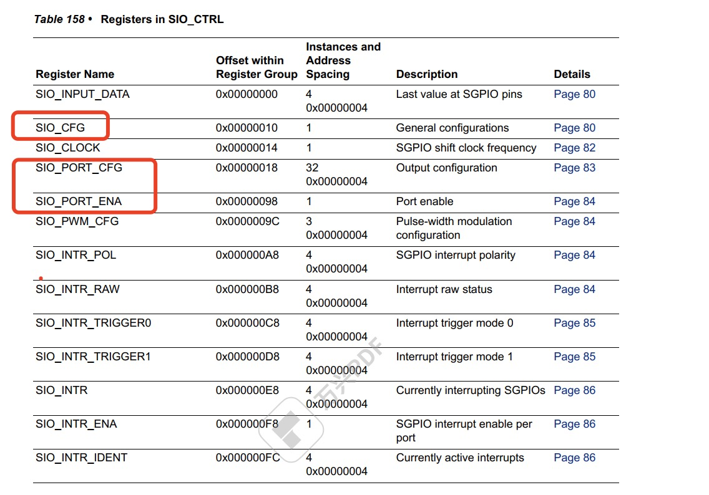
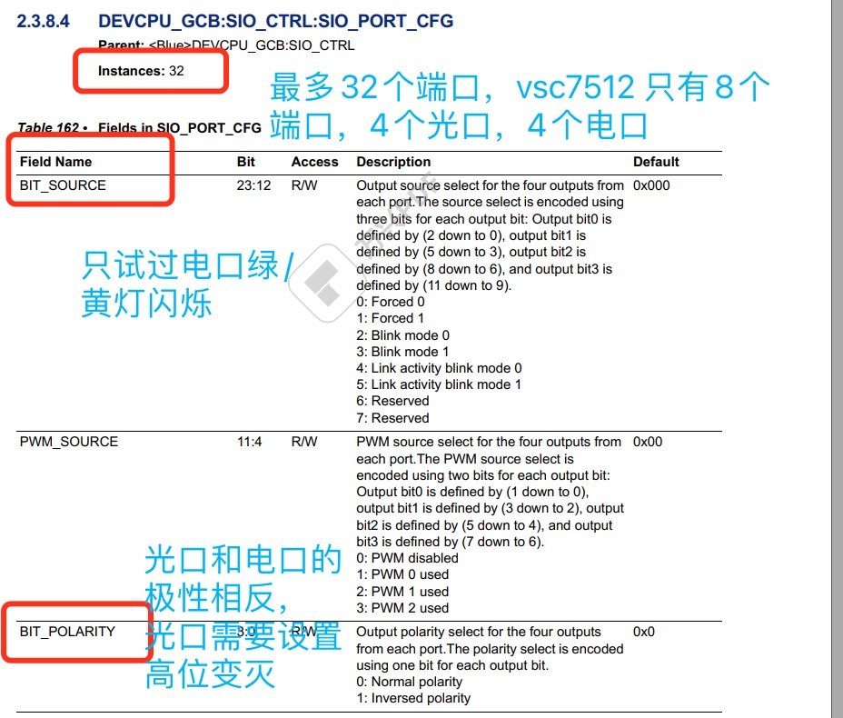
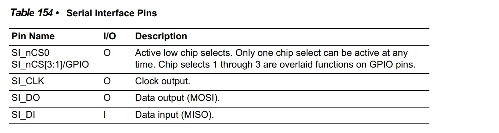
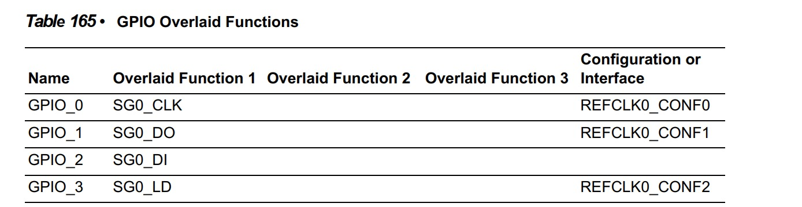

[toc]   

# 端口对应规则

- 面板口分布(按照面板分布排列)
> 1   4   5   7   
> 2   3   6   8

- 面板口和SGPIO 对应规则    
>|SGPIO|逻辑口|面板口| 
>|:---|:---|:----|
>|0|1| 2|   
>|1|2| 3|
>|2|3| 4|
>|3|0| 1|
>|4|4| 5|
>|5|5| 6|
>|6|6| 7|
>|7|7| 8|
***
# 光口闪烁规则
    1、绿灯一般表示link up/down状态；
    2、黄灯一般表示active状态；
    3、绿灯和黄灯都可以配置blink mode0 、blink mode1两种状态；
    4、以上都是推测，没有实际文档描述

***
# 寄存器描述
- vsc7512 寄存器描述    
    - SIO_CFG


    - SIO_PORT_CFG

    - SIO_PORT_ENABLE   
&emsp;<mark>没有试过只单独使能相应的灯的情况

- 灯亮规则
  - 光口    
  >||BIT12|BIT15|    
  >|:---|:---|:---|  
  >|1|绿灭|红亮|
  >|0|绿亮|红灭|
  - 电口
  >||BIT12|BIT15|    
  >|:---|:---|:---|  
  >|1|绿灭|红灭|
  >|0|绿亮|红亮|
***
# GPIO
1、只有两个线路，一根数据输出线SI_DO,一根时钟线
> 

2、只用了GPIO_0, GPIO_1
> 

 3、代码初始化 
   
>
```c
// Configure GPIOs for SGPIO       
    for (gpio_no = 0; gpio_no < 2; gpio_no++) {     
        (void)mesa_gpio_mode_set(NULL, 0, gpio_no, MESA_GPIO_ALT_0);        
    }
```       

***
# note
&emsp;编写代码的时候需要注意光口电口的在点灯逻辑上是相反的
```c
// Port 11:0 with 2 bit per port
        for (port = 0; port < 12; port++) {
            conf.port_conf[port].enabled = true;
            if (port > 3 && port < 8) {
                conf.port_conf[port].mode[OPTICAL_RED] = OPTICAL_RED_OFF;
                conf.port_conf[port].mode[OPTICAL_GREEN] = OPTICAL_GREEN_OFF;
            } else {
                conf.port_conf[port].mode[RED] = ELECTRICAL_YELLOW_OFF;
                conf.port_conf[port].mode[GREEN] = ELECTRICAL_GREEN_OFF;
            }
        }
```